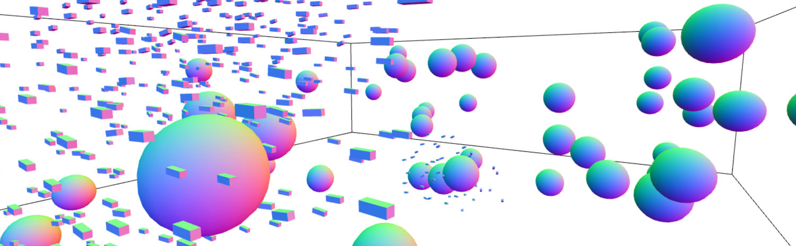
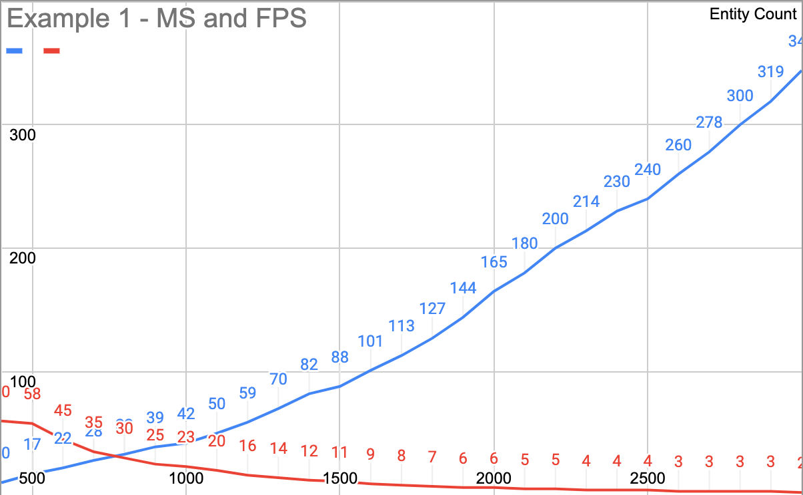
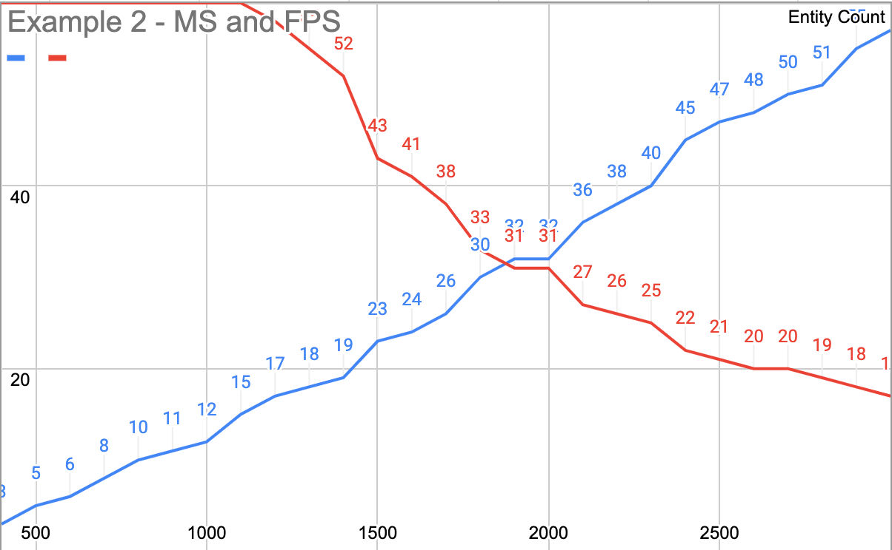
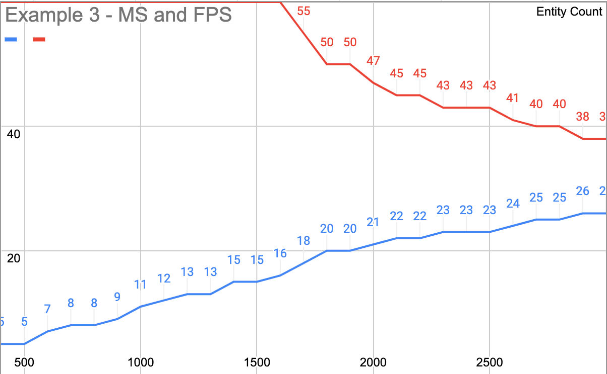
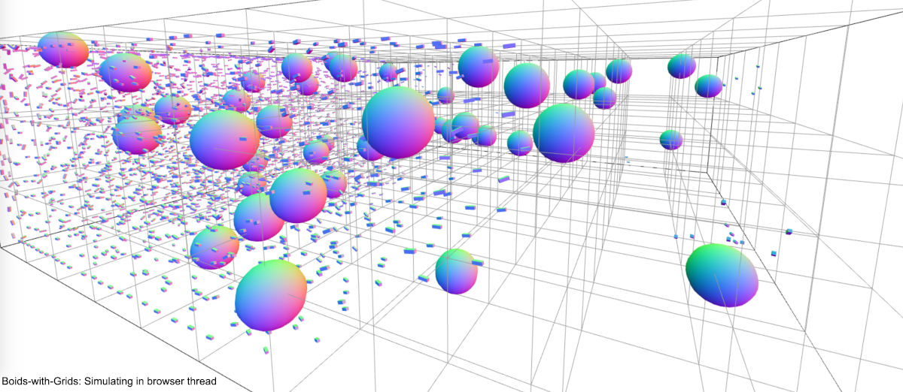
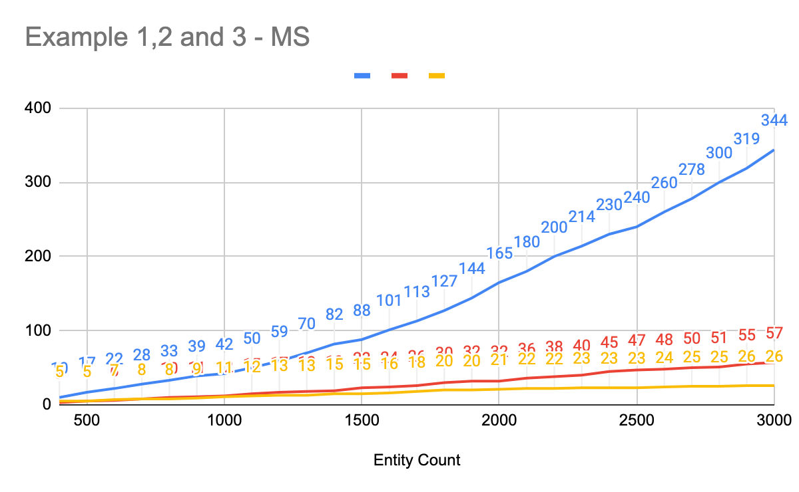

# Experiment with 3D Boids and JavaScript

## Introduction

One of my favourite algorithms is [the boids](https://en.wikipedia.org/wiki/Boids). You can create a flock movement with it. It is easy to understand, and the results are visually convincing. I used it first in one of my games to mimic fleet behaviour. In that game, users were able to move their fighter aircraft with the mouse input. Using the boids algorithm make the animation smooth and believable. That game was in 2D, and I implemented it in C++, so this time, I wanted to implement it in 3D with JavaScript. Calculating many small entities is computationally heavy. On the positive side, discrete operations can be distributed to threads. In this experiment, I implemented my version of the boids algorithm and tried to optimize it using grids (3d bucket lists) and WebWorkers. You can find the source code in [The GitHub Repo](https://github.com/ercang/boids-js).

**You can check out the demo by [clicking here](https://ercang.github.io/boids-js/2-boids-grids/).**

## The Implementation of The Boids

The boids algorithm consists of three basic rules, alignment, cohesion and separation. Also, I added another one for entities to avoid obstacles and boundaries of the world. All of these rules work for a single entity if there is another entity within the awareness radius.

- **Alignment:** Entity's direction is aligned with the average direction in the awareness radius.
- **Cohesion:** This rule is about how much entities are inclined to stick together. Entities try to move to the center of the flock within the awareness radius.
- **Separation:** If entities are too close, they steer away from each other. Again this rule is applied in the awareness radius.
- **Obstacle Avoidance:** Obstacles are different type of entities which are not a part of the flock. These entities represent an obstacle. If an entity gets too close to an obstacle entity, it steers away from it. This rule is also applied for the world boundaries.

## Boids Running in the Browser Thread

After completing the basics of boids, I implemented a simple renderer with ThreeJS to visualize the entities. The spheres represent the obstacles, and the boxes represent the entities in the flock. In the first test case, the iteration must be completed before rendering occurs. The algorithm's complexity is O(n^2)

The blue line represents total milliseconds to compute a single iteration. The red line represents frames per second. The horizontal axis represents the total entity count. I ran the tests starting from 400 entities and increased the entity count to 3000 at the end. As can be seen from the chart, FPS drops dramatically as the number of entities increase.

|Example1 - Browser Thread|Example2 - Grids|Example3 - WebWorkers|
|--------|--------|--------|
||||

It is practically unusable after 800 boids as it drops to 30 frames per second. Also, it is running in the browser thread, so it prevents UI to be updated. You can run this example from the link given below.

[Run Example 1](https://ercang.github.io/boids-js/1-boids-simple/)

## Implementing Spatial Partitioning

Boids algorithm uses nearby entities to calculate an entity's position and velocity. E.g., if a nearby obstacle is found, an avoidance vector is calculated, or if an entity has a nearby neighbour, it tries to align with it. To speed up finding nearby entities, I used a grid system. Alternatively, an octree could be implemented as it will be more memory efficient but implementing a grid is simpler; that's why I selected the grid system for this case.

Basically grid system makes a three-dimensional array for the world. It is easy to find an entity's grid index from its position. If an entity needs to be moved, first the current grid is found, and then the entity is removed from that grid, and afterwards, it is added to the new grid. It is computationally very cheap to find the entities in a grid as the list is already prepared. You can find more information about spatial partitioning [here](http://gameprogrammingpatterns.com/spatial-partition.html).

Implementing a grid system increased performance significantly. You can run this example from the link given below. In this example, the world is quite crowded, so if it were more sparse, the time required to compute a single iteration would increase more linearly. For the best performance, entities should be distributed equally to the cells. If all entities pile up in the same cell, then there will not be any performance improvement.

[Run Example 2 - Grid Support](https://ercang.github.io/boids-js/2-boids-grids/)

## Distributing the work using WebWorkers

There is more room to make the implementation better. We can distribute the workload among different WebWorkers. The upside of making the computation on the WebWorker is separating the work from the UI thread. It will keep the application running at 60 FPS even though the calculation takes more than 16,6 (1000/60) milliseconds. The downside of this approach is having to copy all the world data to WebWorkers and copying it back when they complete the computation on each WebWorker.

|Application|WebWorkerPlanner|WebWorker1|WebWorker2|
|-----------|----------------|-------|-------|
|Request Iteration ->|         |       |       |
| | Split the work according to the entity indices ->
| | | -> Receive iteration command | -> Receive iteration command |
| | | Calculate (0,249) | Calculate(250,500) |
| | | <- Send w1data | <- Send w2data |
| | Receive data and send missing pieces to workers -> |  |  |
| | <- All parts are complete. Update application | Received w2data  | Received w1data  |
| Iteration completed! | | In sync with Worker2 | In sync with Worker1 |

In the WebWorker case, there is a small inconsistency with computing all the data sequentially in a single thread. In the example given above, there are 500 entities. The iteration is done separately for every 250 entities, and they do not affect each other during the iteration. But this does not create a problem with our simulation. It is a minor difference, and the results can not be observed visually. Also, to keep the visualization smooth, the position of every entity is interpolated. If the WebWorker can not complete the job for the next render loop, the renderer still updates the entities in the browser thread.

Using WebWorkers makes the simulation smoother. You can run this example from the link given below. In this example case, using four workers made the most improvement. Using multiple workers cause entity data to be copied numerous times. I think after four WebWorkers, copying the data takes most of the time, and I didn't see any performance improvement. It might be better to use SharedArrayBuffer to prevent copying data. I only implemented "object serialize" methods for the classes, so with proper implementation, SharedArrayBuffer can be used.

[Run Example 3 - WebWorkers [Chrome Only]](https://ercang.github.io/boids-js/3-boids-webworkers/)

**Why this example only works with Chrome?**  
The WebWorker example only works with Chrome because Safari and Firefox do not support import statements in WebWorkers. It is usually not a problem, because using a script packer (e.g. Webpack) should merge all the source files into a single file. To keep the examples simple, I didn't use a script packer.

## Results

The results of the tests are combined into a single chart given above. Blue, red and orange lines represent the example 1,2 and 3 in that order. So it is easier to see the difference between these examples in terms of performance.
